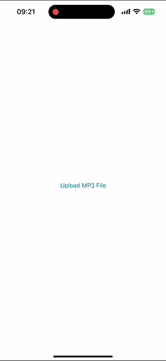

# 🎵 Audio Lyrics Translator

**Audio Lyrics Translator** is a SwiftUI app that recognizes spoken lyrics from an audio file and translates them into another language — all using 100% native Apple frameworks.

## ✨ Features

- 🎧 **Speech Recognition**  
  Transcribes audio files into text using `SFSpeechRecognizer`.

- 🌐 **Translation**  
  Translates recognized lyrics with Apple's `TranslationTask` from the Translate framework.

- 🧠 **Live Transcription Streaming**  
  View the lyrics update in real-time as they’re being recognized.

- 📝 **Side-by-Side Lyrics Viewer**  
  Original and translated lyrics are displayed next to each other for easy comparison.

## 📦 Requirements

- iOS 18+ / macOS 15+  
- Xcode 16+

## 🔐 Privacy

All processing uses Apple APIs, ensuring user data stays private and secure.

## 📌 Notes

- Make sure to request microphone and speech recognition permissions in your app.
- The app only uses Apple-provided libraries — no third-party dependencies.

---

Made with ❤️ using SwiftUI & native Apple tech.
